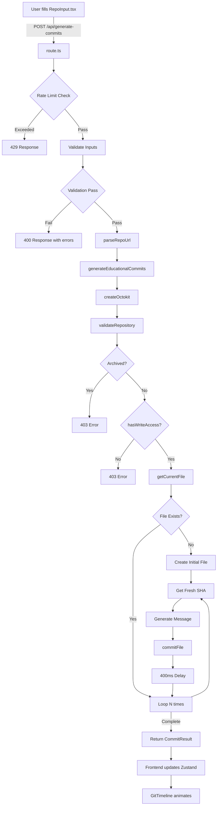

# Automatic Git Commit Tool - Architecture & Implementation Analysis

## Current State Assessment

### Files Successfully Implemented ✅

| File | Status | Notes |
|------|--------|-------|
| `src/app/api/generate-commits/route.ts` | ✅ Complete | Rate limiting, validation, error handling |
| `src/app/lib/github.ts` | ✅ Complete | Octokit integration, commit generation |
| `src/app/lib/validation.ts` | ✅ Complete | All validation functions, bug fixes applied |
| `src/app/store/commitStore.ts` | ✅ Complete | Zustand state management |
| `src/app/components/RepoInput.tsx` | ✅ Complete | Form UI with validation |
| `src/app/components/GitTimeline.tsx` | ✅ Complete | Animated timeline |
| `src/app/layout.tsx` | ✅ Complete | Next.js layout |
| `src/app/page.tsx` | ✅ Complete | Main page |
| `src/app/globals.css` | ✅ Complete | Global styles |
| `package.json` | ✅ Complete | Dependencies |
| `tsconfig.json` | ✅ Complete | TypeScript config |
| `next.config.js` | ✅ Complete | Next.js config |
| `postcss.config.mjs` | ✅ Complete | PostCSS config |

### Categories with Commit Templates (8/47) ✅

The following categories already have 20+ domain-specific commit messages:

1. `ecommerce` - 21 messages
2. `web_development` - 21 messages  
3. `ai_agents` - 19 messages
4. `machine_learning` - 20 messages
5. `cyber_security` - 20 messages
6. `awesome_lists` - 20 messages
7. `web3` - 20 messages
8. `local_to_remote` - 20 messages

### Categories Missing Commit Templates (39/47) ❌

The following categories need unique, domain-specific commit messages added to `templates.ts`:

#### Business & Website Projects (12 categories)
- `business_website`
- `blog_platform`
- `portfolio`
- `education_platform`
- `newsletter_system`
- `magazine_cms`
- `social_media_app`
- `booking_system`
- `saas_platform`
- `landing_page`

#### Software Development (10 categories)
- `mobile_development`
- `full_stack`
- `frontend_project`
- `backend_api`
- `developer_tools`
- `cli_tools`
- `framework_boilerplate`
- `libraries`
- `design_systems`

#### AI & Data (8 categories)
- `deep_learning`
- `data_science`
- `automation_systems`
- `llm_integrations`
- `prompt_engineering`
- `model_evaluation`

#### DevOps & Infrastructure (8 categories)
- `devops`
- `infrastructure`
- `cloud_native`
- `docker_projects`
- `kubernetes`
- `ci_cd`
- `self_hosted`
- `monitoring_tools`

#### Security (4 categories)
- `ethical_hacking`
- `security_research`
- `encryption_systems`

#### Curated & Knowledge Repos (8 categories)
- `cheat_sheets`
- `roadmaps`
- `public_apis`
- `interview_prep`
- `open_source_books`
- `project_based_learning`
- `curated_resources`

#### Emerging Tech (8 categories)
- `blockchain`
- `embedded_systems`
- `iot`
- `low_code`
- `no_code`
- `comparison_repos`
- `top10_collections`

#### Repository Types (4 categories)
- `mirror_repository`
- `archived_repository`
- `internal_tools`

---

## Bug Fix Verification

All 6 critical bug fixes from Section 7 are confirmed applied:

| Bug | Description | Status |
|-----|-------------|--------|
| BUG FIX 1 | Token validation OR logic | ✅ Applied in validation.ts:98 |
| BUG FIX 2 | confirmArchived checkbox enforced | ✅ Applied in RepoInput.tsx:196 |
| BUG FIX 3 | hasWriteAccess called | ✅ Applied in github.ts:211-214 |
| BUG FIX 4 | rateLimitMap memory leak cleanup | ✅ Applied in route.ts:17-22 |
| BUG FIX 5 | setTimeout cleanup in GitTimeline | ✅ Applied in GitTimeline.tsx:16-36 |
| BUG FIX 6 | MAX_COMMITS = 1000 | ✅ Applied in validation.ts:55 |

---

## Security Verification

| Security Requirement | Status |
|---------------------|--------|
| Token never logged | ✅ Verified |
| Token not stored | ✅ Verified |
| Server-side validation | ✅ Verified |
| Rate limiting with cleanup | ✅ Verified |
| IP extraction (x-forwarded-for, x-real-ip) | ✅ Verified |
| hasWriteAccess enforced | ✅ Verified |
| SHA fresh before each commit | ✅ Verified |
| 400ms delay between commits | ✅ Verified |

---

## Architecture Diagram

---

## Implementation Plan

### Phase 1: Complete Commit Templates (Priority: HIGH)

Generate 20+ unique, domain-specific commit messages for each of the 39 missing categories in `templates.ts`.

### Phase 2: Code Mode Implementation

Switch to code mode to update `src/app/utils/templates.ts` with all missing commit templates.

### Phase 3: Verification

- Verify all 47 categories have 20+ messages
- Verify no duplicate messages across categories
- Verify TypeScript compilation succeeds
- Verify no lint errors

---

## Estimated Scope

- **Total categories**: 47
- **Categories needing templates**: 39
- **Messages per category**: 20+
- **Total new messages needed**: ~780+
